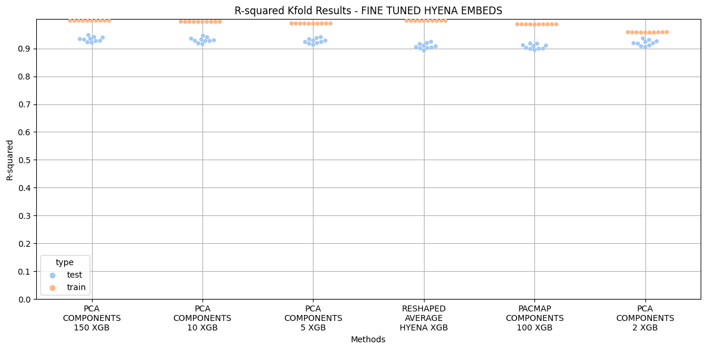
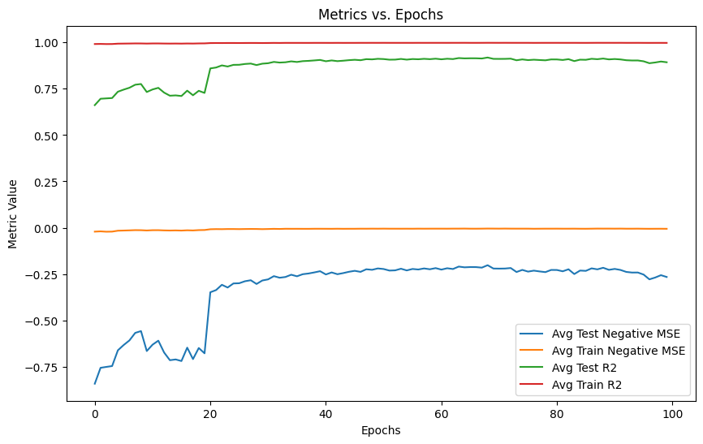
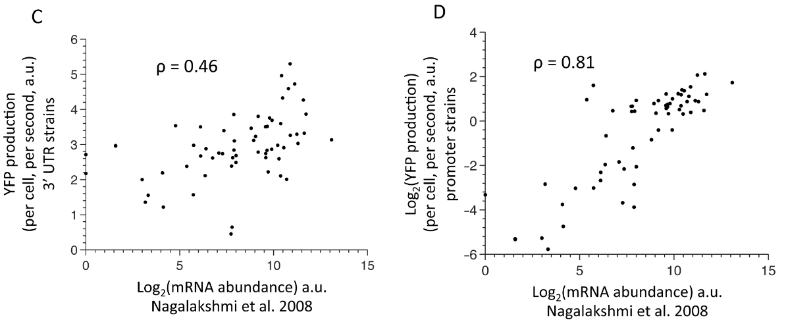

## Summary

This repository is using Hyena-DNA to score terminator sequences. There is a workflow designated by [x]. First though, follow the steps below to setup the environment, local repo, and data structure. You will be able to fine-tune the model from and see the evaluation metrics. The different checkpoints will be saved, so you can load whichever one you would like. 

### Step 1: Clone the Original Hyena-DNA Repository

```bash
git clone https://github.com/HazyResearch/hyena-dna
```

### Step 2: Setup the Environment


```bash
git clone --recurse-submodules https://github.com/HazyResearch/hyena-dna.git && cd hyena-dna
```

```bash
conda create -n ./envs/hyena-dna python=3.8
conda activate hyena-dna
conda install pytorch==1.13.0 torchvision==0.14.0 torchaudio==0.13.0 pytorch-cuda=11.7 -c pytorch -c nvidia
pip install -r requirements.txt
```

```bash
cd hyena-dna
git submodule update --init
cd flash-attention
git submodule update --init
pip install -e . --no-build-isolation
```

### Step 3: Download Data
```bash
https://drive.google.com/drive/folders/1hkVCYSX6OWPs9PLPYS-L9H3c7WmKstdZ?usp=sharing

mv /path/to/data/download /path/to/hyenadna/repo
```

```bash
mv /path/to/data/download /path/to/hyenadna/repo
```

### Step 4: Download this repo: zb-hyena-dna-scripts
---
#### This will contain all the scripts used to fine-tune and evaluate Hyena-DNA for transcription terminator analysis in Yeast, specifically Saccharomyces cerevisiae, the paper with the training data can be found at: this [link](https://journals.plos.org/plosgenetics/article?id=10.1371/journal.pgen.1005147)
---

```bash
git clone https://github.com/zbates1/zb-hyena-dna-scripts.git
```


#### You will need to delete the native Hyena DNA script, 'huggingface.py'. Though it will be replaced with a custom script, after you move the scripts from this repo over

```bash
rm /path/to/hyenadna/huggingface.py
mv /path/to/zb-hyena-dna-scripts/repo/* /path/to/hyenadna/repo
```


##### NOTE: If you find that you are getting errors with the transformer library, specifically the tokenizer module, then remove and re-install the transformers==4.34.0 version


##### Results from [3] and [1b]. Hyena DNA does a great job of predicting gene expression based on 3' sequences, when trained on MPRA experimental data.






##### Before these more complex FM's were available, predicting gene expression with nucleotide sequences was very challenging, especially for terminator sequences. These sequences are integral to mRNA stability. The graph below illustrates that mRNA abundance correlates very well with protein production for promoter sequences, in Figure D, and poorly for varying terminator sequences (Figure C). The high variance/low correlation coefficient seen for terminators reaffirms their effect on protein production post-translation. This offers us the opportunity to create a more predictive model to understand how terminator sequences affect gene expression. Paper [LINK](https://journals.plos.org/ploscompbiol/article?id=10.1371/journal.pcbi.1002934#pcbi-1002934-g003)


